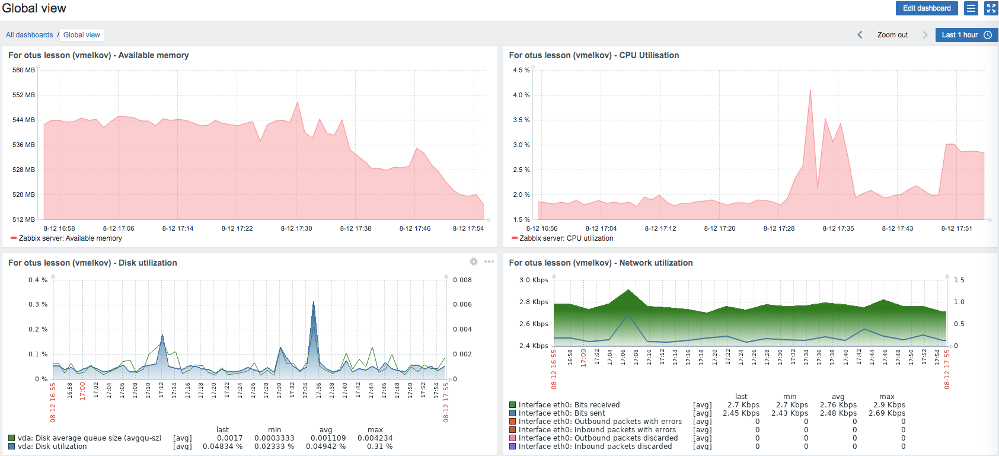

## Домашнее задание "Мониторинг и алертинг"

Настроить дашборд с 4-мя графиками
1) память
2) процессор
3) диск
4) сеть

в качестве результата прислать скриншот экрана - дашборд должен содержать в названии имя приславшего

* * *

## Выполнение:

    git clone https://github.com/zabbix/zabbix-docker.git
    cd zabbix-docker
    git checkout 5.0
    docker-compose -f docker-compose_v3_alpine_mysql_latest.yaml up -d
    docker ps #узнаем ID контейнера с запущенным zabbix-agent. В моем случае c592cbe9946f
    docker inspect c592cbe9946f #узнаем ip-адрес запущенного контейнера с агентом

Далее заходим по адресу 127.0.0.1, логин пароль: Admin zabbix, идем в Configuration-Hosts-Zabbix server и в поле Agent IP address пишем ip-адрес запущенного контейнера с агентом.  
Затем настраиваем необходимые графики на dashboard.

Ссылка на youtube по настройке: <https://youtu.be/ScKlF0ICVYA>
